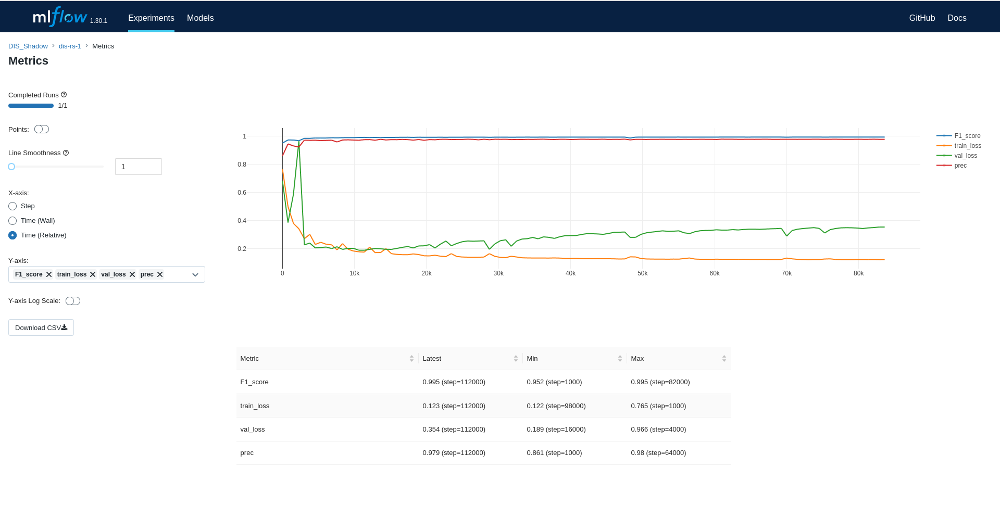

<p align="center">
  
</p>


# DIS model
This repository contains DIS model for Semantic Segmentation with few changes as fallowing:
* update python version to 3.8
* integrate mlflow 
* integrate transfer learning
* support multi GPUs training
* remove cache generator (as some people,  including me,  don't want it )

## 1. System info : 
* Linux Ubuntu 20.04
* GPU Nvidia RTX 3090
* 64GB RAM
* Nvidia Driver: 460.32.03
* CUDA Version: 11.2

## 2. Setup

### create conda environment 
```
conda create -n dis python=3.8
```

### activate the conda environment
```
conda activate dis
```
### install requirements 
```
pip install -r requirements.txt
```
## 3. Dataset
your dataset should be structured as fallow:
```
data/
├── train/
│   ├── im/
│   │   ├── 01.jpg
│   │   ├── 02.jpg
│   │   └── ...
│   └── gt/
│       ├── 01.png
│       ├── 02.png
│       └── ...
├── val/
│   ├── im/
│   │   ├── 01.jpg
│   │   ├── 02.jpg
│   │   └── ...
│   └── gt/
│       ├── 01.png
│       ├── 02.png
│       └── ...
```

## 4. Training:
### arguments
below the main arguments on [train_dis.py](train_dis.py) , change default values if required.

|keyword| type   |
|----|--------|
|--lr| float  |
|--early_stop| int    |
|--model_save_fre| int    |
|--batch_size_train| int    |
|--batch_size_valid| int    |
|--max_ite| int    |
|--max_epoch_num| int    |
|--pretrained_weights| string |
|--multi_gpu| bolean |
|--data_aug| int    |

* For multi GPU training set agr `--multi_gpu` to `True` .
* For transfer learning add your pretrained weight path using arg `--pretrained_weights` otherwise leave it as default.

### Script
to start training the model simply run
```sh
python train_dis.py
```

for live training dashboard using MLflow simply cd to project directory and run on terminal
```sh
mlflow ui
```
then click on the local link on terminal `http://127.0.0.1:5000` , on your browser you'll see mlflow dashboard with training parameters and metrics looking like this :

<p align="center">
  
</p>

## 4. Inference:
for inference update `dataset_path`, `model_path`, and `result_path` paths in [inference.py](inference.py) to your paths and run:
```sh
python inference.py
```


## Citation

<br>

```
@InProceedings{qin2022,
      author={Xuebin Qin and Hang Dai and Xiaobin Hu and Deng-Ping Fan and Ling Shao and Luc Van Gool},
      title={Highly Accurate Dichotomous Image Segmentation},
      booktitle={ECCV},
      year={2022}
}
```

<br>


